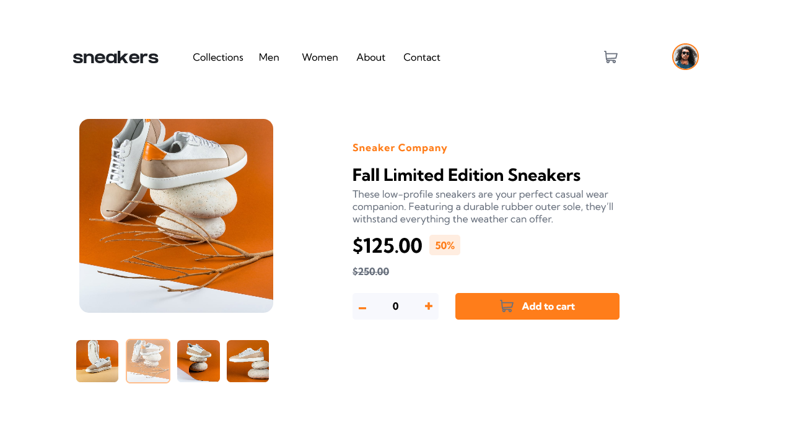
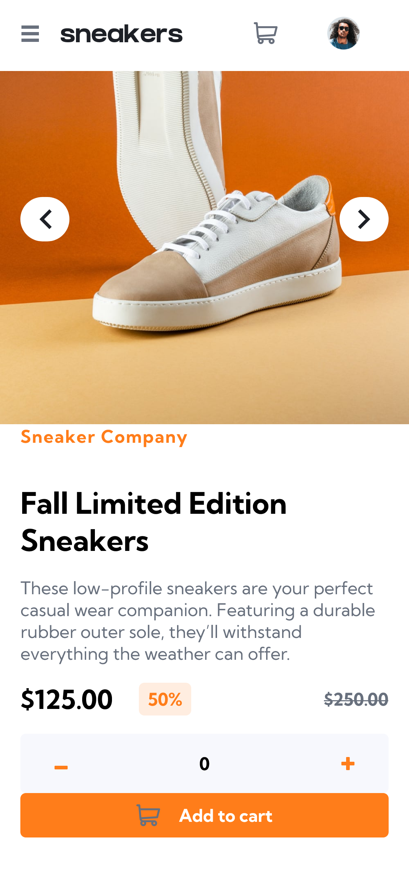

# Frontend Mentor - E-commerce product page solution

This is a solution to the [E-commerce product page challenge on Frontend Mentor](https://www.frontendmentor.io/challenges/ecommerce-product-page-UPsZ9MJp6). Frontend Mentor challenges help you improve your coding skills by building realistic projects.

## Table of contents

- [Overview](#overview)
  - [The challenge](#the-challenge)
  - [Screenshot](#screenshot)
  - [Links](#links)
- [My process](#my-process)
  - [Built with](#built-with)
  - [What I learned](#what-i-learned)
  - [Continued development](#continued-development)
- [Author](#author)

## Overview

### The challenge

Users should be able to:

- View the optimal layout for the site depending on their device's screen size
- See hover states for all interactive elements on the page
- Open a lightbox gallery by clicking on the large product image
- Switch the large product image by clicking on the small thumbnail images
- Add items to the cart
- View the cart and remove items from it

### Screenshot
***In desktop this is result:***

***In mobile this is result:***

### Links

- Solution URL: [Click here](https://github.com/LuccasTraumer/frontend-mentor/tree/main/ecommerce-product-page-main)
- Live Site URL: [Click here](https://frontend-mentor-khaki.vercel.app/comp)

## My process

### Built with

- Semantic HTML5 markup
- CSS custom properties
- Flexbox
- CSS Grid
- Mobile-first workflow
- [Angular](https://angular.io/) - JS library
- [SCSS](https://sass-lang.com/) - For styles

### What I learned

With this test a pratice more about Angular directives and responsive layout, work with mobile and desktop 
sizes. The solutions is not completed but was 80% complete, just need fix some details.

### Continued development

For this solution I used Vercel, to make continuous delivery. Soul every commit in repository is maked a deployment.

## Author

- Website - [Lucas Jesus](https://luccastraumer.github.io/#/home)
- Frontend Mentor - [@luccastraumer](https://www.frontendmentor.io/profile/luccastraumer)
- Twitter - [@luccastraumer](https://www.twitter.com/luccastraumer)
