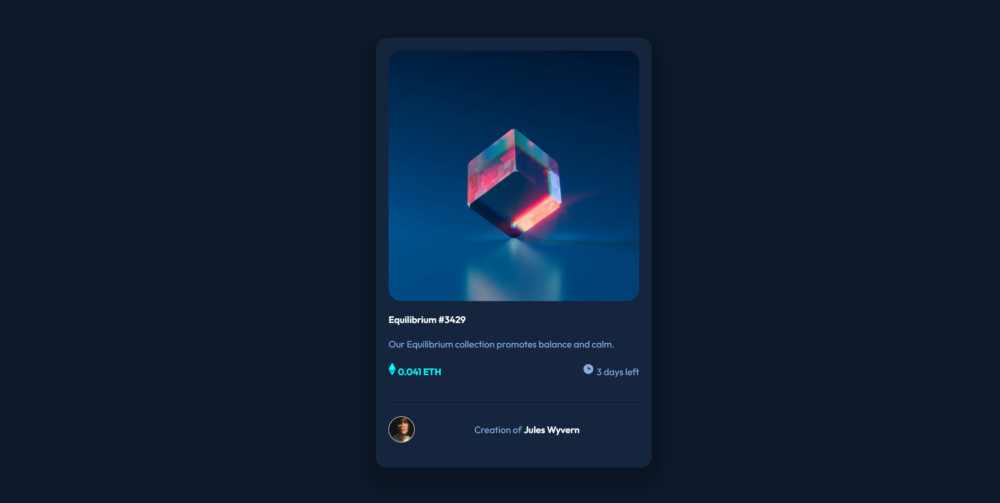
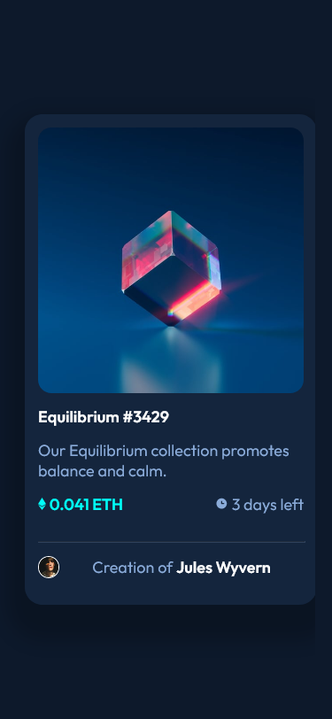

# Frontend Mentor - NFT preview card component solution

This is a solution to the [NFT preview card component challenge on Frontend Mentor](https://www.frontendmentor.io/challenges/nft-preview-card-component-SbdUL_w0U). Frontend Mentor challenges help you improve your coding skills by building realistic projects. 

## Table of contents

- [Overview](#overview)
  - [The challenge](#the-challenge)
  - [Screenshot](#screenshot)
  - [Links](#links)
- [My process](#my-process)
  - [Built with](#built-with)
  - [What I learned](#what-i-learned)
- [Author](#author)

## Overview
### The challenge

#### The Solucion is in /challenge/index.html
Users should be able to:

- View the optimal layout depending on their device's screen size
- See hover states for interactive elements

### Screenshot

***In Desktop the results was:***

***In Mobile the results was:***
### Links
### Not deployed yet
- ***Solution URL: [NOT DEPLOYED](#)***

## My process

### Built with

- Semantic HTML5 markup
- CSS custom properties
- Flexbox
- CSS Grid
- Mobile-first workflow

### What I learned

Learned how to use more specifically, Display grid integrated with display flex in some moments
I don't using anyone framework JS because I don't think was necessary but I will make this card in Angular
for Modularize.

### Continued development

I don't use yet but probably I will use Vercel or Netlify to make deployment to the card.

## Author

- Website - [Lucas Jesus](https://luccastraumer.github.io/#/home)
- Frontend Mentor - [@LuccasTraumer](https://www.frontendmentor.io/profile/LuccasTraumer)
- Twitter - [@luccastraumer](https://www.twitter.com/luccastraumer)