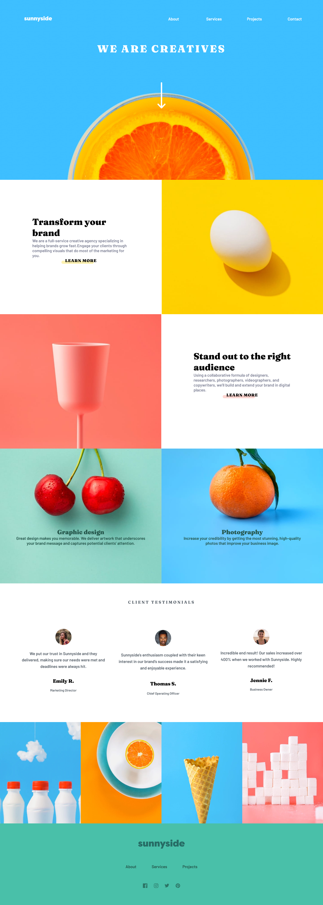
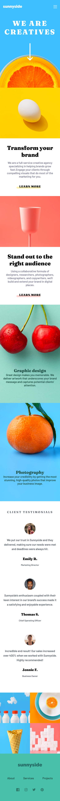

# Frontend Mentor - Sunnyside agency landing page solution

This is a solution to the [Sunnyside agency landing page challenge on Frontend Mentor](https://www.frontendmentor.io/challenges/sunnyside-agency-landing-page-7yVs3B6ef). Frontend Mentor challenges help you improve your coding skills by building realistic projects.

## Table of contents

- [Overview](#overview)
  - [The challenge](#the-challenge)
  - [Screenshot](#screenshot)
  - [Links](#links)
- [My process](#my-process)
  - [Built with](#built-with)
  - [What I learned](#what-i-learned)
  - [Continued development](#continued-development)
  - [Useful resources](#useful-resources)
- [Author](#author)
## Overview

### The challenge

Users should be able to:

- View the optimal layout for the site depending on their device's screen size
- See hover states for all interactive elements on the page

### Screenshot

***In Desktop the results was:***

***In Mobile the results was:***
### Links

- Solution URL: [Github Solution Here](https://github.com/LuccasTraumer/frontend-mentor/tree/main/sunnyside-agency-landing-page-main/agency)
- Live Site URL: [Click Here](https://agency-landing-page-frontend-mentor-ha83cv1uj-luccastraumer.vercel.app/)

## My process

### Built with

- Semantic HTML5 markup
- CSS custom properties
- Flexbox
- CSS Grid
- Mobile-first workflow
- [Angular](https://angular.io/) - JS library

### What I learned

Position and Display none

### Continued development

I don't use yet but probably I will use Vercel or Netlify to make deployment to the card.

## Author
- Website - [Lucas Jesus](https://luccastraumer.github.io/#/home)
- Frontend Mentor - [@luccastraumer](https://www.frontendmentor.io/profile/luccastraumer)
- Twitter - [@luccastraumer](https://www.twitter.com/luccastraumer)
